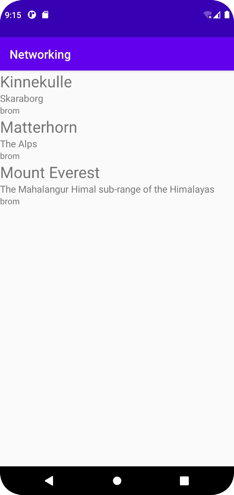

**Raman Rapport - Networking**
Projekted började med att implementera Recycleview på **activity_main.xml**. Därefter sorterade jag min **list_item.xml**, där jag implementerade tre olika textview som fick unika IDs (namn,location,type).
Inom **list_item.xml** använde jag mig av linearlayout vertical. Därefter implementera jag ett MyAdapter class. 
Inom MyAdapter classen implemenera jag metoderna som kommer med RecyclerView.Adapter och MyViewHolder. Innan jag påbörjar skriva kod inom MyAdapter behöver jag sortera ut getters and setters för data som vi kommer hämta från JSON datan. 
I vårt fall är det tre olika getters and setters. Inom MyAdapter kallade vi superclassen MyViewHolder. Inom Classen har vi tre olika private datavariabler och connectade med **list_item.xml** de tre olika textview iderna, genom findviewby resource.
    
    ```
        public class MyViewHolder extends RecyclerView.ViewHolder {
            private TextView name;
            private TextView type;
            private TextView location;
    
    
            public MyViewHolder(@NonNull View itemView) {
                super(itemView);
                name = itemView.findViewById(R.id.name);
                type = itemView.findViewById(R.id.type);
                location = itemView.findViewById(R.id.location);
            }
        }
    ```
Inom MyAdapter classen implementerade jag LayoutInflater som anpassar våran xml till contenten som skickas från Mountain JSON. 
Man kan säga att den blåser upp våran view holder och gör den synlig.

    ```
        public MyAdapter.MyViewHolder onCreateViewHolder(@NonNull ViewGroup parent, int viewType) {
        View view = LayoutInflater.from(parent.getContext()).inflate(R.layout.list_item, parent, false);
        return new MyAdapter.MyViewHolder(view);
    }
    ```
onBindViewHolder positionerar våra dataVariabler från arraylisten och hämtar även från de olika getters som vi har i **Mountain**.

```
    public void onBindViewHolder(@NonNull MyAdapter.MyViewHolder holder, int position) {
        holder.name.setText(mountain.get(position).getName());
        holder.location.setText(mountain.get(position).getLocation());
        holder.type.setText(mountain.get(position).getType());
    }
```
Vi connectar **activity_main.xml** med findviewbyid sen sätter den till new linearlayout för att sedans hämta våran arraylist från myadapter.
Gson använder vi för "unloada" våran data från JSON. 
```
    protected void onCreate(Bundle savedInstanceState) {
        super.onCreate(savedInstanceState);
        setContentView(R.layout.activity_main);

        recycler_view = findViewById(R.id.recycler_view);
        recycler_view.setLayoutManager(new LinearLayoutManager(this));
        mountains = new ArrayList<Mountain>();
        myAdapter = new MyAdapter(mountains);
        recycler_view.setAdapter(myAdapter);

        gson = new Gson();
        type = new TypeToken<ArrayList<Mountain>>() {}.getType();

        new JsonFile(this, this).execute(JSON_FILE);
        new JsonTask(this).execute(JSON_URL);
    }
```
Kod för att unloada vår data, kommentarerna som är inlagt i kodsnittet och rätt så självförklarande.

```
    public void onPostExecute(String json) {
        Log.d("MainActivity", json);
        // Creating a new temporary list, We will fetch the json data and put it in there before updating the mountain list.
        ArrayList<Mountain> temp = new ArrayList <Mountain>();
        temp = gson.fromJson(json, type);
        // Clearing the current arraylist before adding the newly fetched one.
        mountains.clear();
        mountains.addAll(temp);
        myAdapter.notifyDataSetChanged();
    }
```
Bilder läggs i samma mapp som markdown-filen.



